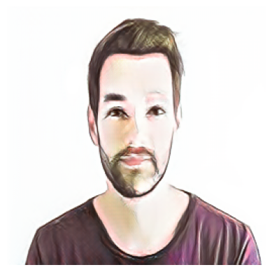

# Implementasi CycleGAN untuk Transformasi Citra Wajah ke Kartun


> **Final Project Mata Kuliah Kecerdasan Buatan (Lanjut)** > Implementasi *Unpaired Image-to-Image Translation* menggunakan arsitektur CycleGAN pada dataset yang tidak seimbang (*imbalanced*).

---

##  Anggota Kelompok 2
| NIM | Nama | Peran |
| :--- | :--- | :--- |
| **23.11.5617** | **Abdi Wicaksono B.S** | Lead Developer (Coding & Training) |
| 23.11.5580 | Calvin Perdana Michael Laoli | Dokumentasi Metode & Arsitektur |
| 23.11.5574 | Yosua Aldrin Garanta | Pengumpulan Dataset & Video |
| 23.11.5566 | Surahman | Testing & Evaluasi Model |

---

##  Deskripsi Proyek
Proyek ini bertujuan untuk mengembangkan model AI yang mampu mengubah foto wajah manusia asli (*Real Face*) menjadi bergaya kartun (*Cartoon Style*) secara otomatis.

Tantangan utama dalam *style transfer* adalah sulitnya mendapatkan dataset berpasangan (foto asli dan lukisan kartunnya dengan pose yang sama persis). Oleh karena itu, kami menggunakan metode **CycleGAN** yang memungkinkan pelatihan menggunakan dataset tidak berpasangan (*Unpaired Dataset*).

###  Fitur & Tantangan Utama
* **Unpaired Training:** Melatih model tanpa data pasangan (hanya folder foto & folder kartun terpisah).
* **Imbalanced Dataset Strategy:** Mengatasi ketimpangan data ekstrem antara **4.000 foto wajah** (CelebA) dan hanya **193 gambar kartun** dengan teknik *Random Oversampling* dan *Early Stopping*.
* **Identity Preservation:** Menggunakan *Cycle Consistency Loss* untuk menjaga agar wajah tetap dikenali meskipun sudah menjadi kartun.

---

##  Hasil Visualisasi (Preview)

| Input (Original) | Output (Cartoon Style) |
| :---: | :---: |
|  |  |
| *Contoh Wajah Asli* | *Hasil Generate AI* |

*(Catatan: Gambar di atas adalah hasil testing model pada Epoch ke-10)*

---

##  Dataset & Arsitektur
**1. Dataset:**
* **Domain A (Source):** [CelebA Dataset](https://mmlab.ie.cuhk.edu.hk/projects/CelebA.html) (4.000 Citra).
* **Domain B (Target):** Custom Cartoon Dataset (Kaggle) (193 Citra).

**2. Spesifikasi Model:**
* **Generator:** ResNet (9 Residual Blocks).
* **Discriminator:** PatchGAN (70x70).
* **Loss Functions:** Adversarial Loss + Cycle Consistency Loss + Identity Loss.

**3. Environment Pelatihan:**
* **GPU:** NVIDIA GeForce GTX 1660 Super (6GB VRAM).
* **Epoch:** 10 (Early Stopping).
* **Training Time:** ~4-5 Jam (Estimasi Lokal).

---

##  Cara Menjalankan (How to Run)

Kamu bisa menjalankan proyek ini menggunakan Google Colab atau Jupyter Notebook lokal.

### Prasyarat
* Python 3.x
* PyTorch & Torchvision
* Matplotlib, Numpy, Pillow

### Langkah-Langkah
1.  **Clone Repository ini:**
    ```bash
    git clone [https://github.com/Bedi002/FPTugasGAN.git](https://github.com/Bedi002/FPTugasGAN.git)
    cd FPTugasGAN
    ```

2.  **Jalankan Notebook:**
    Buka file `CycleGAN_FaceToCartoon.ipynb` (sesuaikan nama file kodinganmu) menggunakan Google Colab atau Jupyter Notebook.

3.  **Load Pre-trained Model (Opsional):**
    Jika ingin langsung mencoba tanpa training ulang, pastikan file model `.pth` sudah ada di folder, lalu jalankan sel bagian *Testing/Inference*.

---

##  Referensi
Proyek ini dikembangkan berdasarkan studi literatur dari penelitian-penelitian berikut:

1.  **[CartoonGAN]** Chen, Y., Lai, Y.-K., & Liu, Y.-J. (2018). *CartoonGAN: Generative adversarial networks for photo cartoonization*. CVPR.
2.  **[GAN]** Goodfellow, I. J., et al. (2014). *Generative adversarial nets*. Advances in Neural Information Processing Systems.
3.  **[ResNet]** He, K., et al. (2016). *Deep residual learning for image recognition*. CVPR.
4.  **[Pix2Pix]** Isola, P., et al. (2017). *Image-to-image translation with conditional adversarial networks*. CVPR.
5.  **[CelebA]** Liu, Z., et al. (2015). *Deep learning face attributes in the wild*. ICCV.
6.  **[CycleGAN]** Zhu, J.-Y., et al. (2017). *Unpaired image-to-image translation using cycle-consistent adversarial networks*. ICCV.

---
**Universitas Amikom Yogyakarta - 2025/2026**
